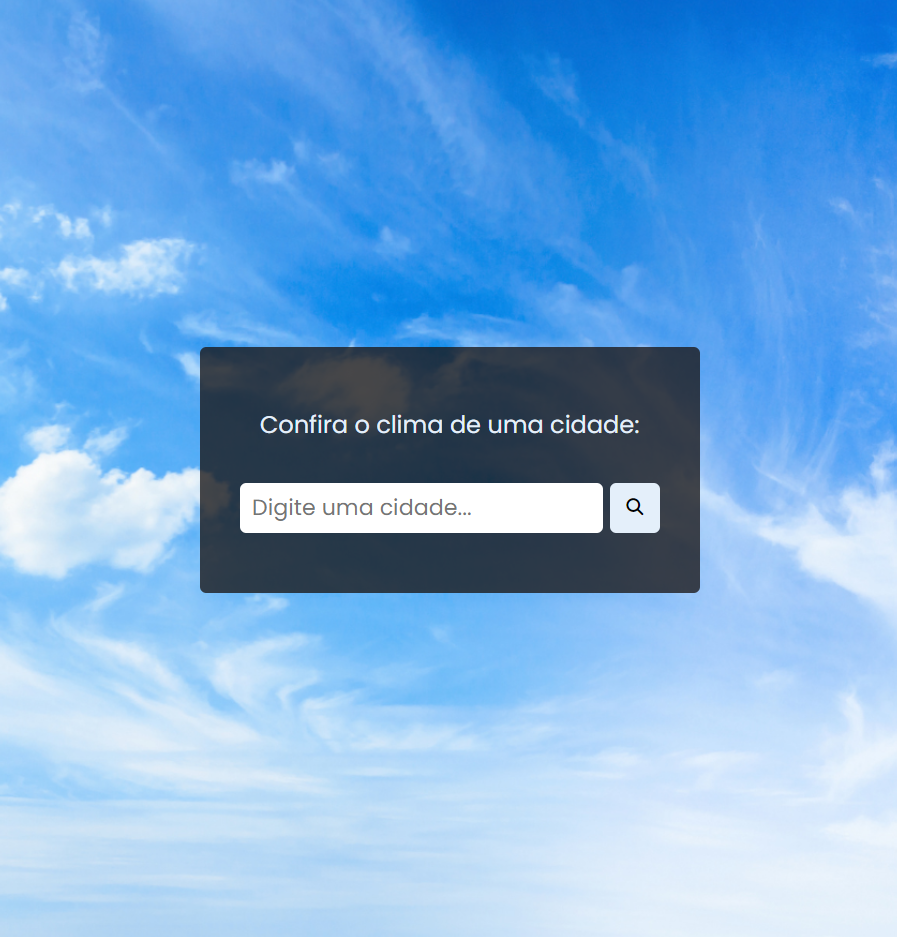
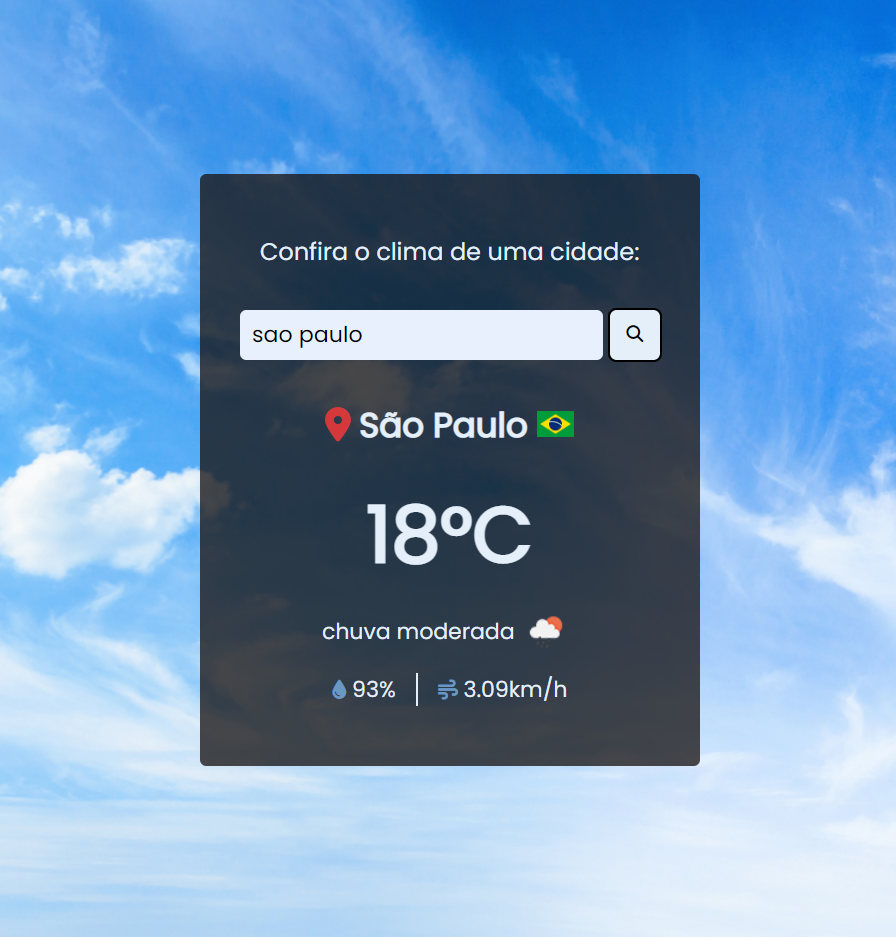
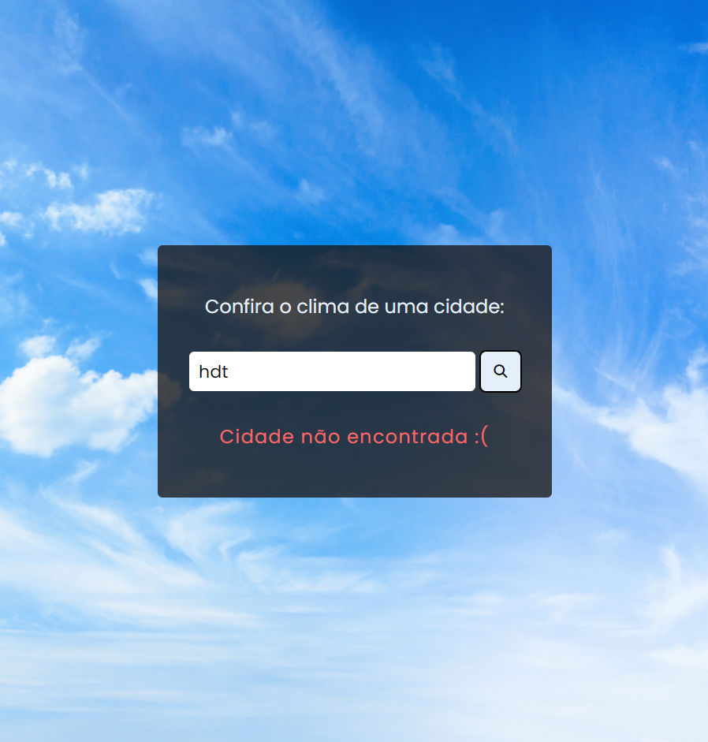

<h1 align="center">Consulta climática</h1>

Consulte de forma rápida como está o clima de uma cidade em qualquer lugar do mundo! Projeto feito com HTML, CSS e JavaScript.

---

**
Sumário:
**

<a href="#sobre">Sobre</a> |
<a href="#funcionalidades">Funcionalidades</a> |
<a href="#tecnologias">Tecnologias</a> |
<a href="#serviços-usados">Serviços usados</a> |
<a href="#imagens">Imagens</a> |
<a href="#como-usar">Como usar</a> |
<a href="#pré-requisitos">Pré-requisitos</a> |
<a href="#links">Links</a> |
<a href="#autor">Autor</a>

## Sobre
Esse projeto foi criado com o objetivo de aprender a consumir os dados de uma API. Consiste em uma aplicação capaz de consultar o clima em tempo real de determinada cidade, estado ou país que o usuário pesquisar.

A ideia veio de um vídeo do canal do Matheus Battisti.

<a href="https://www.youtube.com/watch?v=VS8EBgPwsSU">Link para o vídeo</a>

## Funcionalidades
As principais funcionalidades do projeto são:

✅ Permitir o usuário buscar determinada cidade, estado ou país para saber como está o clima;

✅ Exibir a temperatura e uma descrição do clima (ex: limpo, nublado, etc) do local buscado;

✅ Também é mostrada algumas informações adicionais, como a umidade do ar e a velocidade do vento.

## Tecnologias
* HTML5
* CSS3
* JavaScript

## Serviços usados
* GitHub
* Netlify (hospedagem)
* <a href="https://openweathermap.org/api">Weather API (API de clima)</a>
* <a href="https://www.countryflagsapi.com/">Country Flags API (API de bandeiras de países)</a>

## Imagens
**
Tela inicial para fazer a pesquisa:
**

  

**
Tela com a exibição da busca com as informações do clima:
**

  

**
Mensagem de erro caso o local não seja encontrado:
**

  

## Como usar

Pesquise a cidade, estado ou país que você deseja saber sobre o clima. Caso sua busca não seja encontrada, verifique se o local está escrito de forma correta, respeitando os espaços e acentuações.

Se a busca for bem sucedida, será exibida na tela as informações do clima em tempo real (temperatura, descrição do clima, umidade e velocidade do vento).

## Pré requisitos
Para abrir o sistema, basta o uso de um navegador de sua preferência e conexão com internet.

## Links
* Repositório: https://github.com/CaioAugustoHD/Consulta-climatica
* Deploy: https://consultar-climaa.netlify.app/

## Autor
✨ Feito por Caio Augusto!!!

* caioaugustosbs@gmail.com
* <a href="https://www.linkedin.com/in/caio-augusto-cap/" target=”_blank”>LinkedIn</a>
* <a href="https://github.com/CaioAugustoHD" target=”_blank”>GitHub</a>
