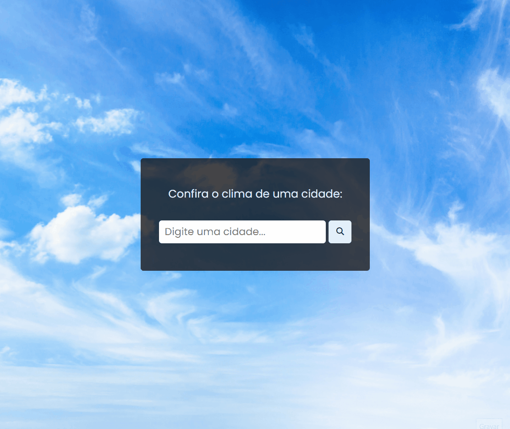

<h1 align="center">Consulta climática ⛅</h1>
<h4 align="center">Consulte de forma rápida como está o clima de uma cidade em qualquer lugar do mundo!</h4>
<h4 align="center"> Projeto feito com HTML, CSS e JavaScript</h4>

&#xa0;

**
Sumário
**

<a href="#dart-sobre">Sobre</a> &#xa0; | &#xa0;
<a href="#white_check_mark-funcionalidades">Funcionalidades</a> &#xa0; | &#xa0;
<a href="#computer-tecnologias">Tecnologias</a> &#xa0; | &#xa0;
<a href="#hammer_and_wrench-serviços">Serviços</a>

<a href="#camera-imagens">Imagens</a> &#xa0; | &#xa0;
<a href="#orange_book-como-usar">Como usar</a> &#xa0; | &#xa0;
<a href="#scroll-pré-requisitos">Pré-requisitos</a> &#xa0; | &#xa0;
<a href="#link-links">Links</a> &#xa0; | &#xa0;
<a href="#sparkles-autor">Autor</a>

 &#xa0;
 
## :dart: Sobre
Esse projeto foi criado com o objetivo de aprender a consumir os dados de uma API. Consiste em uma aplicação capaz de consultar o clima em tempo real de determinada cidade, estado ou país que o usuário pesquisar.

A ideia veio de um vídeo do canal do Matheus Battisti.

<a href="https://www.youtube.com/watch?v=VS8EBgPwsSU">Link para o vídeo</a>

&#xa0;

## :white_check_mark: Funcionalidades
As principais funcionalidades do projeto são:

✔️ Permitir o usuário buscar determinada cidade, estado ou país para saber como está o clima;

✔️ Exibir a temperatura e uma descrição do clima (ex: limpo, nublado, etc) do local buscado;

✔️ Exibir algumas informações adicionais, como a umidade do ar e a velocidade do vento.

&#xa0;

## :computer: Tecnologias
* [HTML](https://developer.mozilla.org/pt-BR/docs/Web/HTML)

* [CSS](https://developer.mozilla.org/pt-BR/docs/Web/CSS)

* [JavaScript](https://www.javascript.com/)

&#xa0;

## :hammer_and_wrench: Serviços
* <a href="https://github.com/">GitHub</a>

* <a href="https://www.netlify.com/">Netlify </a>- hospedagem

* <a href="https://fonts.google.com/">Google Fonts </a>- importação da fonte

* <a href="https://cdnjs.com/libraries/font-awesome">Font-awesome </a>- importação dos ícones

* <a href="https://openweathermap.org/api">Weather API </a>- API de clima

* <a href="https://www.countryflagsapi.com/">Country Flags API </a>- API de bandeiras de países

&#xa0;

## :camera: Imagens
**
Exemplo de funcionamento:
**

  

**
Tela inicial para fazer a pesquisa:
**

  

**
Tela com a exibição da busca com as informações do clima:
**

  

**
Mensagem de erro caso o local não seja encontrado:
**

  

&#xa0;

## :orange_book: Como usar

Pesquise a cidade, estado ou país que você deseja saber sobre o clima. Caso sua busca não seja encontrada, verifique se o local está escrito de forma correta, respeitando os espaços e acentuações.

Se a busca for bem sucedida, será exibida na tela as informações do clima em tempo real (temperatura, descrição do clima, umidade e velocidade do vento).

&#xa0;

## :scroll: Pré requisitos
Para utilizar o sistema, basta um navegador de sua preferência e conexão com internet.

&#xa0;

## :link: Links
* Repositório: https://github.com/CaioAugustoHD/Consulta-climatica
* Deploy: https://consultar-climaa.netlify.app/

&#xa0;

## :sparkles: Autor

<h4>Feito por Caio Augusto Pereira</h4>

&#xa0;

 

